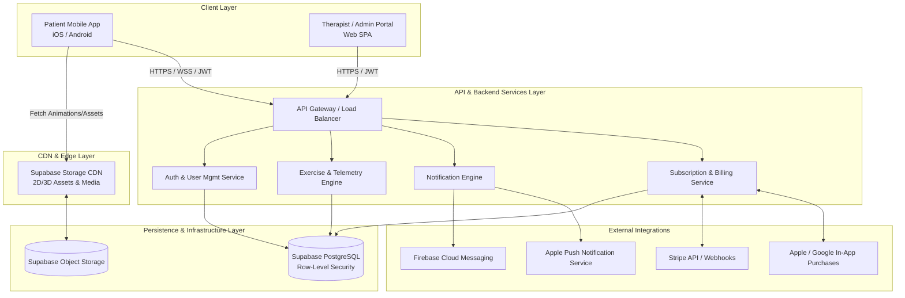
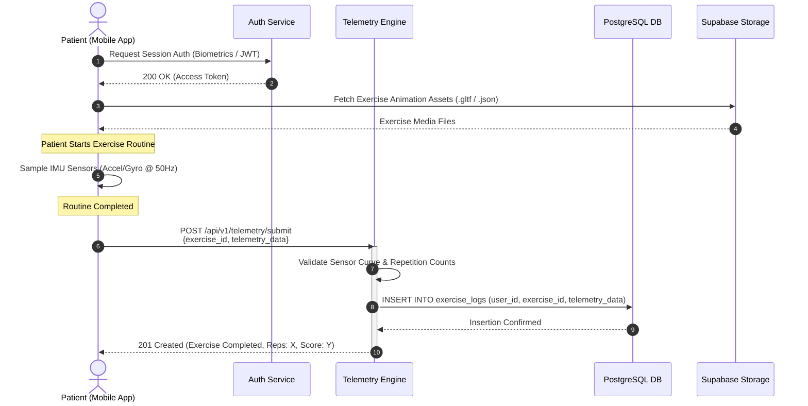

# System Architecture Document: Physical Therapy Platform

## 1. System Overview & Objectives
The Physical Therapy Platform is designed to connect patients undergoing physical rehabilitation with therapists and administrators. The system provides real-time motion capturing via smartphone hardware sensors, automated repetition/exercise verification, tailored exercise plan delivery, and robust administrative oversight.

### Key Architectural Goals
- **Real-Time Telemetry Processing:** Efficiently parse high-frequency device accelerometer and gyroscope data streams.
- **Privacy & Security:** Ensure data isolation using Row-Level Security (RLS) in PostgreSQL, along with HIPAA-compliant data handling principles.
- **Cross-Platform Delivery:** Provide a smooth, offline-capable mobile experience for patients alongside a rich web interface for clinical and administrative management.
- **Scalable Architecture:** Leverage decoupled API microservice/modular monolith patterns powered by Python FastAPI/Flask and Supabase backend services.

---

## 2. High-Level Architecture Diagram



---

## 3. Client Layer Architecture

### 3.1 Patient Mobile Application (iOS & Android)
- **Framework:** Cross-platform React Native or Flutter framework.
- **Core Capabilities:**
  - **Exercise Player:** Interactive canvas/player capable of rendering lightweight 2D animations or 3D models fetched from CDN. Includes play, pause, progress scrub, and auto-step functionality.
  - **Telemetry Capture:** Accesses native hardware sensors via `CoreMotion` (iOS) and `SensorManager` (Android) to sample Accelerometer and Gyroscope data at configurable frequencies (e.g., 50Hz–100Hz).
  - **Local Auth & Security:** Native Face ID / Touch ID integration using hardware KeyStore/Keychain via `LocalAuthentication` wrappers for unlocking stored JWT session refresh tokens.
  - **Notification Handler:** Listens for remote push notifications (FCM/APNs) and registers local push timers for exercise schedules.

### 3.2 Therapist / Administrator Web Portal
- **Framework:** React / Next.js or Vue.js Single Page Application (SPA).
- **Core Capabilities:**
  - **Patient Management:** Allows therapists to create user profiles, adjust limitations, and write medical notes.
  - **Plan Builder:** Drag-and-drop workflow to compose individual exercise schedules mapped to days of the week.
  - **Compliance & Progress Dashboard:** Visualizing patient compliance metrics, historical log trends, and IMU motion curve telemetry analysis.
  - **Admin Overrides:** Privileged views for operational staff to handle password/MFA overrides, account status toggling, manual email modifications, and tier access overrides.

---

## 4. API & Backend Services Layer (Python FastAPI)

### 4.1 Service Breakdown

```
                    ┌───────────────────────────────────┐
                    │      FastAPI Core Framework       │
                    └─────────────────┬─────────────────┘
                                      │
         ┌──────────────────┬─────────┴─────────┬──────────────────┐
         ▼                  ▼                   ▼                  ▼
┌──────────────────┐┌───────────────┐┌──────────────────┐┌──────────────────┐
│  Auth & Identity ││ Sensor/Engine ││  Notifications   ││  Billing Service │
│     Module       ││    Module     ││      Module      ││      Module      │
└──────────────────┘└───────────────┘└──────────────────┘└──────────────────┘
```

1. **Auth & User Management Service:**
   - Issues, refreshes, and revokes JWTs containing user claims (`sub`, `role`, `tier`).
   - Manages verification tokens for phone (SMS) and email onboarding workflows.
   - Enforces Role-Based Access Control (RBAC) middleware verifying permissions (`Patient`, `Therapist`, `Admin`).

2. **Exercise & Telemetry Engine:**
   - **Ingestion:** Exposes endpoints to batch-receive raw dynamic sensor payloads (`{ timestamp, ax, ay, az, gx, gy, gz }`).
   - **Processing Logic:** Runs algorithmic filters (e.g., peak detection, low-pass noise filtering) to evaluate exercise motion curves, score repetition accuracy, and calculate completion rates.
   - **Data Aggregation:** Calculates daily compliance scores and updates user statistics.

3. **Notification Engine:**
   - Asynchronous queue runner (e.g., Celery / Redis or FastAPI Background Tasks).
   - Generates and queues scheduled reminder payloads daily based on patient `plans.schedule_days`.
   - Dispatches notifications via FCM / APNs REST APIs.

4. **Subscription & Billing Service:**
   - Manages billing states (`Free` vs `Premium`).
   - Webhook processing endpoints receiving asynchronous payment lifecycle events from Stripe / Apple App Store / Google Play Store.
   - Synchronizes tier status directly into the database `subscriptions` schema.

---

## 5. Database & Storage Layer (Supabase / PostgreSQL)

### 5.1 Data Schema Design

```sql
-- Enable UUID extension
CREATE EXTENSION IF NOT EXISTS "uuid-ossp";

-- 1. USERS TABLE
CREATE TABLE users (
    id UUID PRIMARY KEY DEFAULT uuid_generate_v4(),
    email VARCHAR(255) UNIQUE NOT NULL,
    phone VARCHAR(50) UNIQUE,
    role VARCHAR(20) NOT NULL CHECK (role IN ('patient', 'therapist', 'admin')),
    auth_type VARCHAR(20) NOT NULL DEFAULT 'password',
    is_active BOOLEAN NOT NULL DEFAULT TRUE,
    created_at TIMESTAMPTZ DEFAULT NOW(),
    updated_at TIMESTAMPTZ DEFAULT NOW()
);

-- 2. HEALTH PROFILES TABLE
CREATE TABLE health_profiles (
    user_id UUID PRIMARY KEY REFERENCES users(id) ON DELETE CASCADE,
    age INT,
    affected_areas TEXT[], -- e.g. Array ['knee_left', 'shoulder_right']
    limitations TEXT[],
    medical_notes TEXT,
    created_at TIMESTAMPTZ DEFAULT NOW(),
    updated_at TIMESTAMPTZ DEFAULT NOW()
);

-- 3. EXERCISES TABLE
CREATE TABLE exercises (
    id UUID PRIMARY KEY DEFAULT uuid_generate_v4(),
    title VARCHAR(150) NOT NULL,
    animation_url TEXT NOT NULL,
    is_premium BOOLEAN DEFAULT FALSE,
    target_sensors JSONB NOT NULL, -- Config: target angles, primary axes, thresholds
    created_at TIMESTAMPTZ DEFAULT NOW()
);

-- 4. PLANS TABLE
CREATE TABLE plans (
    id UUID PRIMARY KEY DEFAULT uuid_generate_v4(),
    patient_id UUID REFERENCES users(id) ON DELETE CASCADE,
    therapist_id UUID REFERENCES users(id) ON DELETE SET NULL,
    schedule_days INT[] NOT NULL, -- e.g. [1, 3, 5] for Mon/Wed/Fri
    exercise_ids UUID[] NOT NULL,
    is_active BOOLEAN DEFAULT TRUE,
    created_at TIMESTAMPTZ DEFAULT NOW(),
    updated_at TIMESTAMPTZ DEFAULT NOW()
);

-- 5. EXERCISE LOGS TABLE
CREATE TABLE exercise_logs (
    id UUID PRIMARY KEY DEFAULT uuid_generate_v4(),
    user_id UUID REFERENCES users(id) ON DELETE CASCADE,
    exercise_id UUID REFERENCES exercises(id) ON DELETE RESTRICT,
    completed_at TIMESTAMPTZ DEFAULT NOW(),
    telemetry_data JSONB NOT NULL -- Raw or compressed sensor data array + performance metrics
);

-- 6. SUBSCRIPTIONS TABLE
CREATE TABLE subscriptions (
    id UUID PRIMARY KEY DEFAULT uuid_generate_v4(),
    user_id UUID UNIQUE REFERENCES users(id) ON DELETE CASCADE,
    tier VARCHAR(20) NOT NULL DEFAULT 'free' CHECK (tier IN ('free', 'premium')),
    stripe_sub_id VARCHAR(255),
    expires_at TIMESTAMPTZ,
    created_at TIMESTAMPTZ DEFAULT NOW(),
    updated_at TIMESTAMPTZ DEFAULT NOW()
);

-- Performance Indexes
CREATE INDEX idx_exercise_logs_user_id ON exercise_logs(user_id);
CREATE INDEX idx_plans_patient_id ON plans(patient_id);
CREATE INDEX idx_subscriptions_user_id ON subscriptions(user_id);
```

### 5.2 Row-Level Security (RLS) Policies

```sql
-- Enable RLS on all sensitive tables
ALTER TABLE health_profiles ENABLE ROW LEVEL SECURITY;
ALTER TABLE exercise_logs ENABLE ROW LEVEL SECURITY;
ALTER TABLE plans ENABLE ROW LEVEL SECURITY;
ALTER TABLE subscriptions ENABLE ROW LEVEL SECURITY;

-- Health Profiles Policies
CREATE POLICY "Patients can view their own profile"
    ON health_profiles FOR SELECT
    USING (auth.uid() = user_id);

CREATE POLICY "Therapists/Admins can view and edit all profiles"
    ON health_profiles FOR ALL
    USING (
        EXISTS (
            SELECT 1 FROM users
            WHERE users.id = auth.uid() AND users.role IN ('therapist', 'admin')
        )
    );

-- Exercise Logs Policies
CREATE POLICY "Users can insert their own exercise logs"
    ON exercise_logs FOR INSERT
    WITH CHECK (auth.uid() = user_id);

CREATE POLICY "Users can view their own exercise logs"
    ON exercise_logs FOR SELECT
    USING (auth.uid() = user_id);

CREATE POLICY "Therapists and Admins can view all exercise logs"
    ON exercise_logs FOR SELECT
    USING (
        EXISTS (
            SELECT 1 FROM users
            WHERE users.id = auth.uid() AND users.role IN ('therapist', 'admin')
        )
    );
```

### 5.3 Supabase Object Storage
- **Bucket Structure:**
  - `assets-public/`: Static thumbnail previews, publicly accessible standard assets.
  - `exercise-animations/`: Optimized vector/Lottie animations or GLTF/GLB 3D model files cached at the edge via Supabase CDN (`Cache-Control: public, max-age=31536000`).

---

## 6. End-to-End Data Flow: Telemetry & Exercise Execution



---

## 7. Security, Privacy & Operational Guardrails

1. **Data Encryption Standard:**
   - **In-Transit:** All client-to-backend communication strictly restricted to TLS 1.3 encryption.
   - **At-Rest:** Database storage and Supabase object buckets encrypted via AES-256 standards.
2. **Biometrics & Authentication:**
   - Raw biometric data (fingerprints/Face ID hashes) **never** leave the native patient device hardware enclave.
   - Mobile app relies strictly on native OS success responses before unsealing stored JWT tokens.
3. **Role-Based Authorization Framework:**
   - API endpoints enforce RBAC middleware checks at the gateway layer.
   - Patient users are prevented from executing mutations on admin/therapist endpoints via RLS and JWT claim validation.
```

I have created the full architecture documentation based on your feature requirements and backend specs.

### Summary of what was created:
- **`system_architecture.md`**: Contains a structured breakdown of the system, including:
  - **High-level architecture & sequence diagrams** using Mermaid.
  - **Client & Backend Service architecture** specifying responsibilities and technology stacks.
  - **PostgreSQL Database DDL Schema** complete with explicit column types, primary/foreign keys, and indexes.
  - **Row-Level Security (RLS) policies** to guarantee multi-tenant patient data privacy.
  - **Security, privacy, and data flow specifications**.

Let me know if you would like to adjust any of the database schemas, add specific microservices, or expand on any individual component!