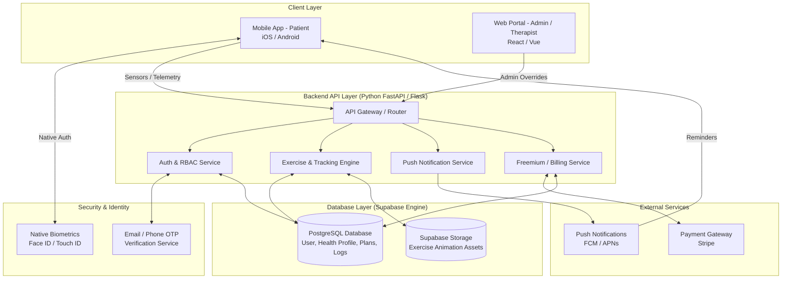

```mermaid
flowchart TD
    subgraph Clients["Client Layer"]
        A[Mobile App - Patient\niOS / Android]
        B[Web Portal - Admin / Therapist\nReact / Vue]
    end

    subgraph Auth["Security & Identity"]
        FaceID[Native Biometrics\nFace ID / Touch ID]
        MFA[Email / Phone OTP\nVerification Service]
    end

    subgraph API["Backend API Layer (Python FastAPI / Flask)"]
        Gateway[API Gateway / Router]
        AuthSvc[Auth & RBAC Service]
        ExSvc[Exercise & Tracking Engine]
        NotifSvc[Push Notification Service]
        BillSvc[Freemium / Billing Service]
    end

    subgraph External["External Services"]
        FCM[Push Notifications\nFCM / APNs]
        Stripe[Payment Gateway\nStripe]
    end

    subgraph DB["Database Layer (Supabase Engine)"]
        SupabaseDB[(PostgreSQL Database\nUser, Health Profile, Plans, Logs)]
        Storage[(Supabase Storage\nExercise Animation Assets)]
    end

    %% Client Interactions
    A <-->|Native Auth| FaceID
    A -->|Sensors / Telemetry| Gateway
    B -->|Admin Overrides| Gateway
    
    %% API Routing
    Gateway --> AuthSvc
    Gateway --> ExSvc
    Gateway --> NotifSvc
    Gateway --> BillSvc

    %% Service Integration
    AuthSvc <--> MFA
    NotifSvc --> FCM
    FCM -->|Reminders| A
    BillSvc <--> Stripe

    %% Database Connections
    AuthSvc <--> SupabaseDB
    ExSvc <--> SupabaseDB
    ExSvc <--> Storage
    BillSvc <--> SupabaseDB
```